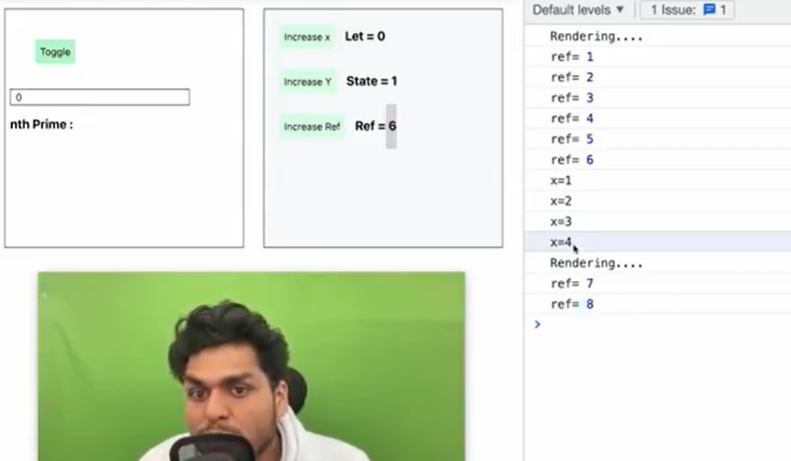
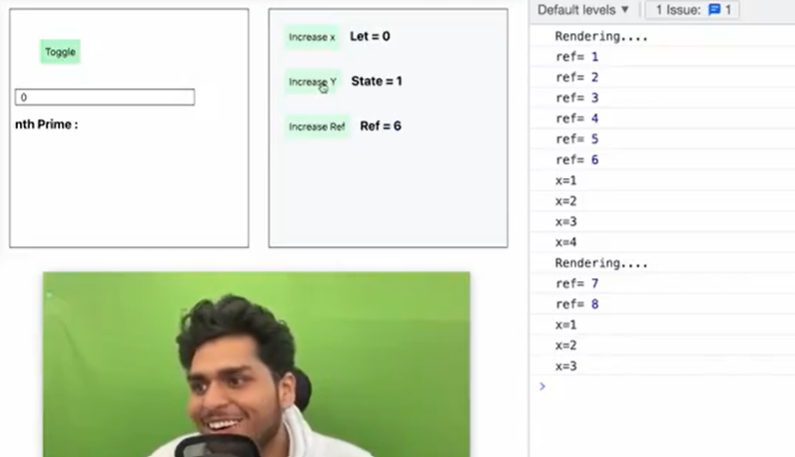
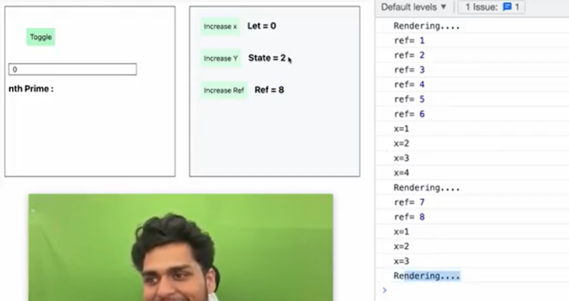

# Building YouTube

### Read about it?

- Read useSearchParams
- browser urlSearchParams

### Higher Order Function?

- A function take a component and return a component is called HOF. Basicaly it's add some extra functionality on returning component.

### Debouncing?

typing slow = 200ms
typing fast = 30ms

**Performance**:

- iphone pro max = 12 letter \* 1000people = 12000 API Calls

- with debouncing = 3 API calls \* 1000 = 3000

**Debouncing applied with 200ms**:

- if difference between 2 key strokes is less than < 200ms- DECLINE API call

- if > 200ms make an API call

### Caching?

- Cache:
  **time complexity to search in Array = O(n)**
  ["i", "ip", "iph"]
  **time complexity to search in Object = O(1)**
  {
  i:
  ip:
  iph:
  }

  - o of 1 is for better than o of n
  - searchin inside object `new Map()` is more optimize.

  **Note:-** Search is using live api , search is using dbouncing and our search is using caching.

## How we will build n level nested comment?

- using recursion for building n level nested comment

## What is LRU cache?

## Building Live Chat?

**Challenges:-**

- Data Layer - Get data live
- UI Layer - update the ui

- Live chat >>>>>> infinite scroll >>> Pagination

**Data Live:**

- there are two ways we can handle live data

- **1:- Web Socket:** Web socket is a two way connection ui and server side and this quickley send data from both of side so it's a by directional live data. websocket have `no regular interval`.
  example:- Trading App, whatsapp

- **2:- API Polling:** UI request the server and the data flow server to ui. It's one directional and API Polling `have interval`.
  Example:- gmail, cricbuzz

## useMemo()?

- ### [useMemo doc](https://react.dev/reference/react/useMemo)

- useMemo is a React Hook that lets you cache the result of a calculation between re-renders.

```
const cachedValue = useMemo(calculateValue, dependencies)
```

## useCallback

- ### [useCallback](https://react.dev/reference/react/useCallback)

- useCallback is a React Hook that lets you cache a function definition between re-renders.

```
const cachedFn = useCallback(fn, dependencies)
```

## useRef

- ### [useRef](https://react.dev/reference/react/useRef)

- useCallback is a React Hook that lets you cache a function definition between re-renders.

```
const ref = useRef(initialValue)
```

## what difference between normal js variable(let, const, var), state variable and useRef variable?

- If normal js variable value `let a = 10` is changed it's not re-render the our comonent(function) and not update the value on ui but when we use state variable it's re-render the component and when this state re-render the component so our ui is update already with updated value, but if we use useRef it's not re-rendering the comonent it's persist or it's hold the value and when any got re-rendering, ref is update the our ui with new value.

- So basically I want a variable which should not rest when my re-render happen but it's hold that value, still react should track it, this is our useRef().

- ref is not like a normal variable , ref is like an object. Instead of a value when you create a useRef it comes an object with the current hardcoded inside it.

```
const ref = useRef(0);
console.log (ref)// ref = {current: 0}
```




